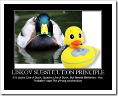

# Liskov Substitution Principle(LSP)

> The LSP states that in an object-oriented program, if we substitute a superclass object reference with an object of any of its subclasses, the program should not break.


## Example

In mathematics, a Square is a Rectangle. Indeed it is a specialization of a rectangle. The "is a" makes you want to model this with inheritance. However if in code you made Square derive from Rectangle, then a Square should be usable anywhere you expect a Rectangle. This makes for some strange behavior.

Imagine you had `SetWidth` and `SetHeight` methods on your Rectangle base class; this seems perfectly logical. However if your Rectangle `reference` pointed to a `Square`, then `SetWidth` and `SetHeight` doesn't make sense because setting one would change the other to match it. In this case `Square` fails the Liskov Substitution Test with `Rectangle` and the abstraction of having Square inherit from Rectangle is a bad one.

```C++
#include <iostream>
#include <cstdio>
#include <string>
#include <vector>
#include <fstream>
#include <boost/lexical_cast.hpp>

using namespace std;
using namespace boost;

class Rectangle
{
    protected:
        int width, height;

    public:
        Rectangle(int width, int height): width(width), height(height)
        {

        }

        int getWidth() const{
            return width;
        }

        int getHeight() const{
            return height;
        }

        virtual void setWidth(int width) {
            Rectangle::width = width;
        }

        virtual void setHeight(int height){
            Rectangle::height = height;
        }

        int area() const
        {
            return width*height;
        }
};

class Square: public Rectangle
{
    public:
        Square(int size): Rectangle(size,size)
        {

        }
    void setWidth(int width) override
    {
        this->width = this->height = width;
    }   

    void setHeight(int height) override
    {
        this->width = this->height = height;
    }
};

void process(Rectangle& r)
{
    int w=r.getWidth();
    r.setHeight(10);
    cout<< "expected area = "<< (w*10)
        <<", got "<<r.area()<<endl;
}

// The call of sqaure with process function, we can see that it fails 
// The better way of creating a sqaure would be to create a factory such as below and then we can adhere it to the liskov substitution principle
struct RectangleFactory
{
  static Rectangle create_rectangle(int w, int h);
  static Rectangle create_square(int size);
};

int main()
{
    Rectangle r{3,4};
    process(r);

    Square sq{5};
    process(sq);

    return 0;
}

```

Output Console:
```html
expected area = 30, got 30
expected area = 50, got 100

```

Another example:

If it looks like a duck, quacks like a duck, but needs batteries – you probably have the wrong abstraction




## Reference
1. [Desing Principles Illustrations](http://web.archive.org/web/20160521015258/https://lostechies.com/derickbailey/2009/02/11/solid-development-principles-in-motivational-pictures/)
