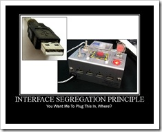

# Interface Segregation Principle

> “Clients should not be forced to depend upon interfaces that they do not use.” — Robert Martin, paper “[The Interface Segregation Principle](https://web.archive.org/web/20150905081110/http://www.objectmentor.com/resources/articles/isp.pdf)”

Example:

How not to do it: 

```c++
struct Document;
struct IMachine
{
    virtual void print(Document& doc) = 0;
    virtual void scan(Document& doc) = 0;
    virtual void fax(Document& doc)= 0;
};

//If I need a MultiFinctionPrinter which can scan, print and fax, I have a class from which I can derive
struct MFP: IMachine
{
    void print(Document &doc) override
    {

    }
    void scan(Document &doc) override
    {

    }
    void fax(Document &doc) override
    {
        
    }
};

//Now if I need another machine that I only need for scan, we have an issue
//What do we do with the print() and fax()?
//we can leave than blank or write exceptions for using
//however we are giving a wrong machine to the client by giving unnecessary interfaces(APIS)
//Hence we need to Segregate the interfaces.(Check another main.cpp file)
struct Scanner: IMachine
{
    void print(Document &doc) override
    {

    }
    void scan(Document &doc) override
    {
        //OK
    }
    void fax(Document &doc) override
    {
        
    }
};

```

How to do it: 

```C++
struct Document;
struct IPrinter
{
    virtual void print(Document& doc)=0;
};
struct IScanner
{
    virtual void scan(Document& doc)=0;
};
struct IFax
{
    virtual void fax(Document& doc)=0;
};

//Now if we need a Multi function printer which can print and scan we can do it by:
struct IMachine: IPrinter,IScanner
{
    void print(Document& doc) override
    {

    }
    void scan(Document& doc) override
    {
        
    }
};
//If we need a machine that only prints
struct Scanner: IScanner
{
    void scan(Document& doc) override
    {

    }   
};

//We can also reuse the IMachine Interface and create decorators
struct Machine:IMachine
{
    IPrinter& printer;
    IScanner& scanner;
    //constructor
    Machine(IPrinter &print, IScanner &scanner): printer(printer),scanner(scanner)
    {

    }
    void print(Document& doc) override
    {
        printer.print(doc);
    }
    void scan(Document& doc) override
    {
        scanner.scan(doc);
    }    

};
```

Example :-)

You want me to plug this in, where?

 
