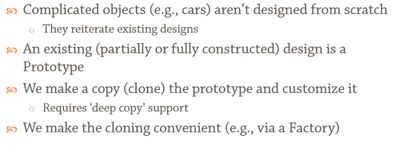

# Prototype

> Prototype is a creational design pattern that lets you copy existing objects without making your code dependent on their classes.

## Motivation

 

Protoype is basically :

 

---
## Summary 

 

---

## References
1. [Prototype](https://refactoring.guru/design-patterns/prototype)