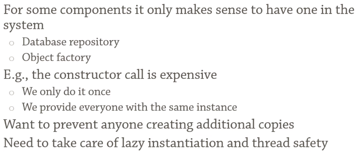

# Singleton

> Singleton is a creational design pattern that lets you ensure that a class has only one instance, while providing a global access point to this instance.

## Motivation

Singleton

--- 

## References
1. [Singleton](https://refactoring.guru/design-patterns/singleton)